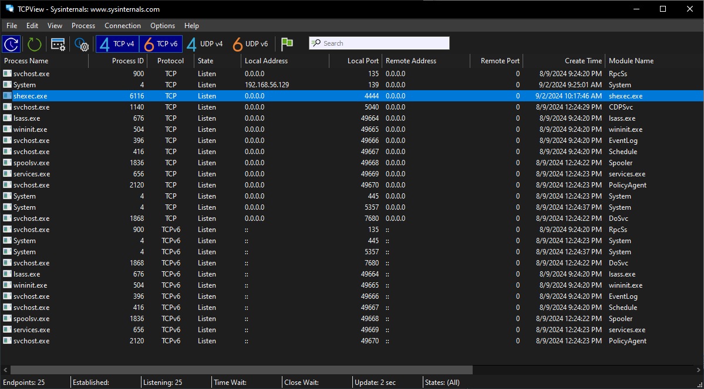

# Introduction

shadow-shell is a cyber lab designed for:

- analyzing shellcode
- exploring memory exploits
- supporting malware analysis

# Repository structure

The repository contains two main parts:

- **arsenal**: command line tools to support malware analysis
    - `shexec`: a shellcode runner that can be combined with other tools like `strace` (Linux), `ProcMon` and `TCPView` (Windows) to analyze shellcode functionality
- **lab**: experimental code snippets, some are documented while others are not

:warning: You should **never** execute untrusted shellcode on your system. Use a hardened VM or container for this purpose.

```
arsenal/
├── linux/
│   ├── arm64/
│   │   ├── shexec.s: Linux ARM64 shellcode runner
│   │   ├── shcode_hello.s: Linux ARM64 shellcode that prints "Hello!"
│   │   └── shcode_shell.s: Linux ARM64 shellcode that opens a shell
│   ├── x64/
│   │   ├── shexec.s: Linux x64 shellcode runner
│   │   └── shcode_hello.s: Linux x64 shellcode that prints "Hello, World!"
│   └── shexec.c: Linux shellcode runner (used as a reference while implementing shexec.s for different architectures)
└── windows/
    └── shexec.c: Windows shellcode runner
```

```
lab/
├── linux/
│   └── buffer-overflow/: proof of concept for a buffer overflow with the goal of executing shellcode
└── windows/
    └── shellcode/: proof of concept for basic shellcode execution
```
Both POCs are documented in detail on my blog:

- https://shadowshell.io/diving-into-shellcodes
- https://shadowshell.io/shattering-the-stack-0
- https://shadowshell.io/shattering-the-stack-1
- https://shadowshell.io/shattering-the-stack-2

# Workflow

## Shellcode analysis

1. **Emulate the shellcode**  
   Use an emulator like [Qiling](https://github.com/qilingframework/qiling) to analyze the shellcode.

2. **Fallback to `shexec` + `strace`**  
   If you suspect the shellcode may detect the emulator (and behave differently as a result) switch to using `shexec` with `strace`.

3. **Fallback to eBPF tracing**  
   If the shellcode seems to detect that it is being traced by `strace` use [eBPF tracing](https://github.com/gemesa/sys-scout).

# How to build

## Prerequisites

```
$ sudo dnf install docker
$ sudo dnf install mingw64-gcc
$ sudo dnf install nasm
$ pip install frida-tools
$ rustup target add x86_64-pc-windows-gnu
```

## x64 codebase

```
$ make x64
```

## ARM64 codebase

I have an x64 PC so to quickly build and run ARM64 binaries my preference is to use an ARM64v8 Docker container. This setup has some limitations though as it does not implement `ptrace` so `strace` and `gdb` cannot be used.

```
$ sudo docker build --platform=linux/arm64 -t arm64-env .
$ sudo docker run --platform=linux/arm64 --user $(id -u):$(id -g) --rm -it -v "$(pwd)":/workspace arm64-env /bin/bash
# make arm64
```

Alternatively an ARM64 cross-compiler and QEMU could also be used (Docker is doing something similar under the hood).

```
$ dnf search *aarch64*
$ sudo dnf install gcc-aarch64-linux-gnu
$ sudo dnf install binutils-aarch64-linux-gnu
$ sudo dnf install qemu-system-aarch64
$ sudo dnf install qemu-system-aarch64-core
$ sudo dnf install qemu-user-static-aarch64
$ sudo dnf install sysroot-aarch64-fc41-glibc
```

```
$ aarch64-linux-gnu-gcc -L /usr/aarch64-redhat-linux/sys-root/fc41/lib64 -L /usr/aarch64-redhat-linux/sys-root/fc41/lib --sysroot=/usr/aarch64-redhat-linux/sys-root/fc41 arsenal/linux/arm64/shexec.s -o shexec
$ aarch64-linux-gnu-as arsenal/linux/arm64/shcode_hello.s -o shcode_hello.o
$ aarch64-linux-gnu-ld shcode_hello.o -o shcode_hello
$ llvm-objcopy -O binary --only-section=.text shcode_hello shcode_hello.bin
$ qemu-aarch64 -L /usr/aarch64-redhat-linux/sys-root/fc41/usr shexec shcode_hello.bin
file size: 52 bytes
Hello!
```

If you have a Raspberry Pi you can use it with all the debugging tools including `strace` and `gdb`.

# How to use

## Linux ARM64

### `shexec`

```
$ make arm64
$ ./build/linux/arm64/shexec build/linux/arm64/shcode_hello.bin
file size: 52 bytes
Hello!
$ echo $$
1918
$ ./build/linux/arm64/shexec build/linux/arm64/shcode_shell.bin
file size: 40 bytes
$ echo $$
19341
$ exit
$ strace ./build/linux/arm64/shexec build/linux/arm64/shcode_hello.bin
...
openat(AT_FDCWD, "build/linux/arm64/shcode_hello.bin", O_RDONLY) = 3
newfstatat(3, "", {st_mode=S_IFREG|0755, st_size=52, ...}, AT_EMPTY_PATH) = 0
newfstatat(1, "", {st_mode=S_IFCHR|0620, st_rdev=makedev(0x88, 0), ...}, AT_EMPTY_PATH) = 0
getrandom("\x20\xc3\xbe\x6a\x9d\x68\x76\xf9", 8, GRND_NONBLOCK) = 8
brk(NULL)                               = 0x55754e8000
brk(0x5575509000)                       = 0x5575509000
write(1, "file size: 52 bytes\n", 20file size: 52 bytes
)   = 20
mmap(NULL, 52, PROT_READ|PROT_WRITE, MAP_PRIVATE|MAP_ANONYMOUS, -1, 0) = 0x7facfe6000
read(3, "\1\251\214\322\201\215\255\362\341-\304\362A\1\340\362\341\217\37\370 \0\200\322\341\3\0\221\342\0\200\322"..., 52) = 52
close(3)                                = 0
mprotect(0x7facfe6000, 52, PROT_READ|PROT_WRITE|PROT_EXEC) = 0
write(1, "Hello!\n", 7Hello!
)                 = 7
exit(0)                                 = ?
```
## Linux x64

### `shexec`

```
$ make x64
$ ./build/linux/x64/shexec build/linux/x64/shcode_hello.bin
file size: 57 bytes
Hello, World!
$ msfvenom -p linux/x64/exec CMD='echo \"Hello, World!\"' -f raw -o shellcode.bin
$ ./build/linux/x64/shexec shellcode.bin
file size: 57 bytes
Hello, World!
$ strace ./build/linux/x64/shexec build/linux/x64/shcode_hello.bin 
...
openat(AT_FDCWD, "build/linux/x64/shcode_hello.bin", O_RDONLY) = 3
fstat(3, {st_mode=S_IFREG|0755, st_size=57, ...}) = 0
fstat(1, {st_mode=S_IFCHR|0620, st_rdev=makedev(0x88, 0x1), ...}) = 0
getrandom("\xae\x28\x5d\xfd\xd1\xae\x82\x68", 8, GRND_NONBLOCK) = 8
brk(NULL)                               = 0x55c7bbc4d000
brk(0x55c7bbc6e000)                     = 0x55c7bbc6e000
write(1, "file size: 57 bytes\n", 20file size: 57 bytes
)   = 20
mmap(NULL, 57, PROT_READ|PROT_WRITE, MAP_PRIVATE|MAP_ANONYMOUS, -1, 0) = 0x7f94405b3000
read(3, "H\307\300\1\0\0\0H\307\307\1\0\0\0H\2155\25\0\0\0H\307\302\17\0\0\0\17\5H\307"..., 57) = 57
close(3)                                = 0
mprotect(0x7f94405b3000, 57, PROT_READ|PROT_WRITE|PROT_EXEC) = 0
write(1, "Hello, World!\n\0", 15Hello, World!
)       = 15
exit(0)                                 = ?
```

## Windows x64

### `shexec.exe`

```
$ make x64
$ msfconsole
msf6 > info payload/windows/x64/shell_bind_tcp
...
Basic options:
Name      Current Setting  Required  Description
----      ---------------  --------  -----------
EXITFUNC  process          yes       Exit technique (Accepted: '', seh, thread, process, none)
LPORT     4444             yes       The listen port
RHOST                      no        The target address

Description:
  Listen for a connection and spawn a command shell (Windows x64)
...
msf6 > exit
$ msfvenom -p windows/x64/shell_bind_tcp -f raw -o shellcode.bin
```

Open `ProcMon` and `TCPView` then:

```
> .\shexec.exe shellcode.bin
```



# References

- https://chromium.googlesource.com/chromiumos/docs/+/HEAD/constants/syscalls.md
- https://wiki.osdev.org/Calling_Conventions
- https://en.wikipedia.org/wiki/X86_calling_conventions
- https://www.felixcloutier.com/x86/
- https://www.ibm.com/docs/en/aix/7.1?topic=volumes-using-file-descriptors
- https://www.ibm.com/docs/en/i/7.5?topic=extensions-standard-c-library-functions-table-by-name
- https://cs.lmu.edu/~ray/notes/gasexamples/
- https://web.stanford.edu/class/cs107/guide/x86-64.html
- http://unixwiz.net/techtips/x86-jumps.html
- https://cs.brown.edu/courses/cs033/docs/guides/x64_cheatsheet.pdf
- https://stackoverflow.com/questions/38335212/calling-printf-in-x86-64-using-gnu-assembler
- https://github.com/reg1reg1/Shellcode
- https://godbolt.org/
- https://dogbolt.org/
- https://nitesculucian.github.io/2018/07/24/msfvenom-cheat-sheet/
- https://ivanitlearning.wordpress.com/2018/10/14/shellcoding-with-msfvenom/
- https://security.stackexchange.com/questions/176495/executing-a-msfvenom-shellcode-in-c-program
- http://0xdabbad00.com/2012/12/07/dep-data-execution-prevention-explanation/
- https://learn.microsoft.com/en-us/windows/win32/api/memoryapi/nf-memoryapi-virtualalloc
- https://crates.io/crates/windows
- https://github.com/microsoft/windows-rs
- https://microsoft.github.io/windows-docs-rs/doc/windows/Win32/System/Memory/fn.VirtualAlloc.html
- https://stackoverflow.com/questions/31492799/cross-compile-a-rust-application-from-linux-to-windows
- https://doc.rust-lang.org/core/ptr/fn.copy_nonoverlapping.html
- https://github.com/muhammet-mucahit/Security-Exercises
- https://lettieri.iet.unipi.it/hacking/aslr-pie.pdf
- https://reverseengineering.stackexchange.com/questions/19598/find-base-address-and-memory-size-of-program-debugged-in-gdb
- https://syscall.sh/
- https://developer.arm.com/documentation
- https://gist.github.com/luk6xff/9f8d2520530a823944355e59343eadc1
- https://www.exploit-db.com/exploits/47048
